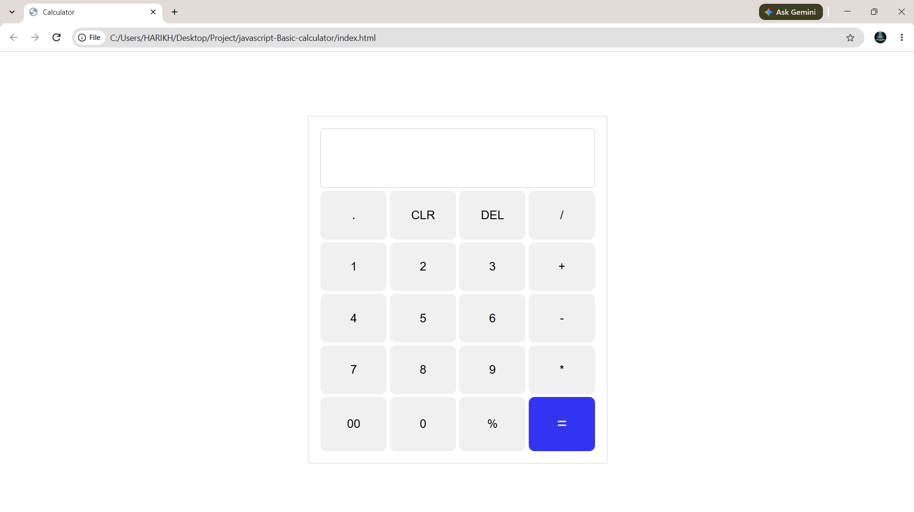

# JavaScript Basic Calculator

A simple and responsive calculator application built using HTML, CSS, and JavaScript.

## Features

* Addition
* Subtraction
* Multiplication
* Division
* Clear functionality
* Simple and user-friendly interface

## Technologies Used

* HTML
* CSS
* JavaScript

## Project Screenshot

